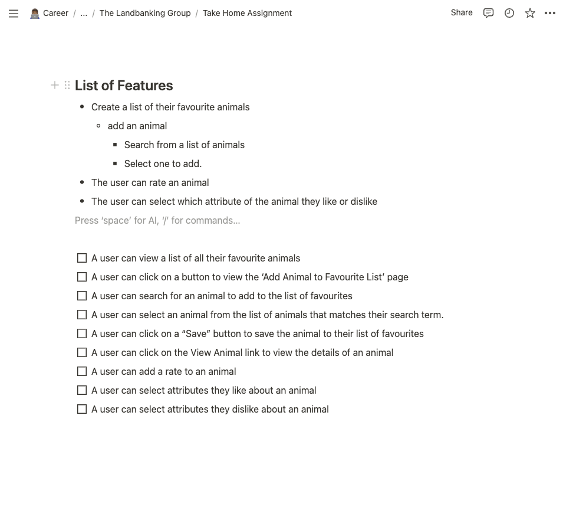

# Favourite Animals App

### Demo
https://www.loom.com/share/6eeb765668a64024b5cf336bc34ae54e


### Running

First, run the development server:

```bash
npm run dev
# or
yarn dev
# or
pnpm dev
# or
bun dev
```

Open [http://localhost:3000](http://localhost:3000) with your browser to see the result.


### Technologies Used

* React (Next.JS)
* TailwindCSS
* Fetch API
* Localstorage

Because of time-constraint I didn't add any test


## Process



The first thing I did was to go through the document and list all the features that must be covered by the solution.

After this, I setup my environment. Installed and configured all the tools I needed.

After this, I implemented a bare version of these functionalities inside the page `page.js` file.

I then refactored some of these functionalities into smaller components

My final task was working on the design and cleaning up the appearance.


### There are a few bugs, including a user can both like and dislike a character. But with more time, I would have spent some of it writing tests for the app.


